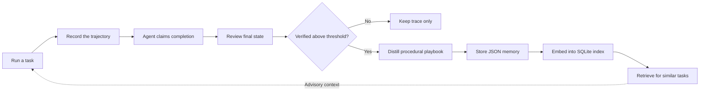
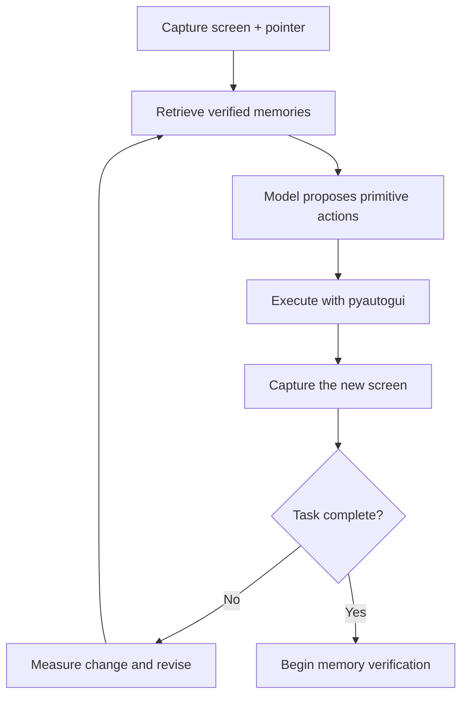

<div align="center">

# MMFCUA

### Muscle memory for computer-use agents

**A macOS agent that turns successful UI interactions into reusable procedural
memory.**

</div>

---

MMFCUA completes small desktop tasks through screenshots, mouse input, and
keyboard input. The interesting part is not getting a model to click the right
place once. It is deciding what can be learned from a successful run, storing
that knowledge safely, and making it useful when a similar task appears later.

> **Core idea:** a completion claim is not a memory. A run becomes reusable only
> after its final state has been independently reviewed and its useful structure
> has been distilled into a confidence-gated playbook.

## At a glance

| | |
|---|---|
| **Input** | A short, visually verifiable desktop task |
| **Control** | Screenshots and constrained `pyautogui` actions |
| **Evidence** | Append-only JSONL execution traces |
| **Admission** | Independent review of the final screen and trajectory |
| **Memory** | Structured procedural playbooks stored as JSON |
| **Retrieval** | Exact, lexical, and embedding-based search over SQLite |
| **Policy** | Current visual state always overrides historical experience |

MMFCUA is a focused research prototype, not a general desktop assistant or a
chat interface around an automation script.

## Memory lifecycle



### 1. Record

Every task creates an append-only trace in `.runs/`. It captures:

- the initial screen and pointer state;
- model decisions and requested actions;
- tool outcomes and observation errors;
- visible screen changes;
- the final completion claim.

Events are written incrementally, so evidence from an interrupted run survives.

### 2. Verify

The execution agent saying `done` is not accepted as proof.

A separate review pass examines the final screenshot and a compact trajectory.
It decides whether the requested outcome is visibly supported and assigns a
confidence score. Runs below `MMFCUA_MEMORY_MIN_CONFIDENCE` remain available as
traces but are not promoted into reusable memory.

This creates a deliberate boundary between **task execution** and **memory
admission**.

### 3. Distill

Verified runs are compressed into procedural playbooks:

| Playbook field | Purpose |
|---|---|
| Task signature | Identifies the class of task |
| Applicability | Defines when the memory is relevant |
| Target mappings | Connects requested concepts to effective UI targets |
| Preferred plan | Preserves useful steps, preconditions, and checks |
| Fallbacks | Records bounded alternative strategies |
| Avoid list | Captures actions or assumptions that failed |
| Environment facts | Retains context that must be revalidated |

The playbook keeps reusable structure without preserving the run as a brittle
macro.

> [!IMPORTANT]
> Historical pointer coordinates are evidence, not executable instructions.
> MMFCUA must locate semantic targets again from the current screenshot.

### 4. Store

Accepted playbooks are written to `.memories/` as readable JSON documents. Their
embeddings and source data are maintained in a local SQLite index:

```text
.runs/                  append-only execution evidence
.memories/              verified procedural playbooks
.memory_index.sqlite3   local semantic search index
```

The index refreshes incrementally. Exact-task memories are reused rather than
duplicated unless a later run contributes a previously unseen target mapping.

### 5. Retrieve

Before each decision, MMFCUA searches prior experience using three signals:

1. exact normalized task matching;
2. lexical overlap across task signatures and learned aliases;
3. cosine similarity over embeddings.

Only memories above the relevance threshold enter the model context. Retrieved
knowledge remains advisory: application state, aliases, preconditions, and
success checks must all be confirmed against the current screen.

## Execution loop



The model emits structured JSON rather than free-form instructions. Its action
space is limited to pointer movement, clicks, dragging, scrolling, typing,
keyboard shortcuts, and waits.

A lightweight image diff detects action batches with no visible effect. The
next decision is then prompted to inspect blockers or change strategy instead
of repeating nearby clicks. Textual history remains available, while only the
newest screenshot is retained in model context.

The LLM is one replaceable component in this system. Trace persistence,
admission policy, playbook structure, retrieval, deduplication, and tool
execution are implemented locally.

## Architecture

```text
agent_loop.py       observation, retrieval, action, and verification lifecycle
memory.py           run recording, review, and playbook persistence
memory_search.py    SQLite vector index, retrieval, and deduplication
tools.py            constrained mouse and keyboard primitives
conversation.py     multimodal LiteLLM conversation state
prompt.j2           computer-use policy and action contract
memory_prompt.j2    verification and playbook extraction contract
prompt_ui.py        native task-input launcher
components/         Swift/AppKit prompt interface
```

## Quick start

### Requirements

- macOS
- Python and `pip`
- Xcode Command Line Tools
- an OpenAI API key

### Install

The native task prompt is compiled with `swiftc` on its first run:

```bash
xcode-select --install
pip install -r requirements.txt
```

Create `.env`:

```env
OPENAI_API_KEY=...
LITELLM_MODEL=gpt-5.4-mini
```

Run:

```bash
python main.py
```

A native prompt appears near the bottom of the active display. Enter one short
task and press **Enter**. Press **Escape** to close it without submitting.

### Example tasks

```text
open Firefox and search for weather in Rome
open the Downloads folder
find the keyboard settings
```

The best tasks have one concrete outcome that can be confirmed visually.

## macOS permissions

In **System Settings > Privacy & Security**, grant the terminal or IDE running
`python main.py`:

- **Accessibility**
- **Screen Recording**

Fully quit and reopen the terminal or IDE after changing either permission.
Without them, screenshots may be blank and input actions may silently fail.

> [!NOTE]
> The current implementation assumes macOS screenshots, AppKit, and macOS
> keyboard conventions. Windows and Linux support would require replacing those
> platform-specific components.

## Configuration

The defaults are suitable for short interactive tasks. Override only the
settings relevant to an experiment:

```env
# Main and review models
LITELLM_MODEL=gpt-5.4-mini
MMFCUA_REVIEW_MODEL=gpt-5.4-mini
MMFCUA_REASONING_EFFORT=none
MMFCUA_VERBOSITY=low
MMFCUA_MAX_COMPLETION_TOKENS=800
MMFCUA_STREAM_MODEL_OUTPUT=1

# Memory admission and retrieval
MMFCUA_MEMORY_MIN_CONFIDENCE=0.75
MMFCUA_EMBEDDING_MODEL=text-embedding-3-small
MMFCUA_MEMORY_SEARCH_MIN_SCORE=0.72
MMFCUA_MEMORY_SEARCH_LIMIT=2

# Prompt caching
LITELLM_PROMPT_CACHE_RETENTION=24h

# Observation and input timing
MMFCUA_OBSERVATION_SETTLE_SECONDS=0.1
MMFCUA_MOUSE_PIXELS_PER_SECOND=1800
MMFCUA_MOUSE_MIN_DURATION=0.12
MMFCUA_MOUSE_MAX_DURATION=0.7
MMFCUA_TYPE_INTERVAL=0.02
MMFCUA_POST_TYPE_SETTLE_SECONDS=0.8
```

`OPENAI_SERVICE_TIER` is passed through when present.

<details>
<summary><strong>Troubleshooting the native prompt</strong></summary>

If the prompt window does not open:

- confirm that `swiftc --version` succeeds;
- install the Xcode Command Line Tools with `xcode-select --install`;
- allow `.build/prompt_input` in **System Settings > Privacy & Security** if
  macOS blocks it;
- run from a normal logged-in desktop session rather than a headless shell.

</details>

## Safety

MMFCUA can move the pointer and type into the active interface. Run it in a
supervised desktop session and begin with low-risk tasks.
